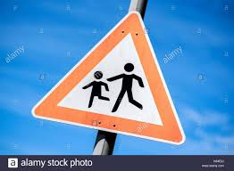

# **Traffic Sign Recognition** 

## Writeup

### You can use this file as a template for your writeup if you want to submit it as a markdown file, but feel free to use some other method and submit a pdf if you prefer.

---

**Build a Traffic Sign Recognition Project**

The goals / steps of this project are the following:
* Load the data set (see below for links to the project data set)
* Explore, summarize and visualize the data set
* Design, train and test a model architecture
* Use the model to make predictions on new images
* Analyze the softmax probabilities of the new images
* Summarize the results with a written report

[//]: # (Image References)

[image1]: ./examples/visualization.jpg "Visualization"
[image2]: ./examples/grayscale.jpg "Grayscaling"
[image3]: ./examples/random_noise.jpg "Random Noise"
[image4]: ./test_images_web/1.jpg "Traffic Sign 1"
[image5]: ./test_images_web/2.jpg "Traffic Sign 2"
[image6]: ./test_images_web/3.jpg "Traffic Sign 3"
[image7]: ./test_images_web/4.jpg "Traffic Sign 4"
[image8]: ./test_images_web/5.jpg "Traffic Sign 5"
[histogram]: ./media/histogram.png "Histogram"
[scale/translate]: ./media/scale-translate.png "scale/translat"
[scale]: ./media/scale.png "scale"
[translate]: ./media/translate.png "translate"

Here is a link to my [project code](https://github.com/mikeliao97/CarND-Traffic-Sign-Classifier-Project)

### Data Set Summary & Exploration

#### 1. Basic summary of the data set.

The dataset used was the [german traffic signs dataset](http://benchmark.ini.rub.de/?section=gtsrb&subsection=dataset)

* The size of training set: 34799 images
* The size of the validation set is: 4410 images
* The size of test set is : 12630
* The shape of a traffic sign image is : (32, 32, 3)
* The number of unique classes/labels in the data set is : 43

#### 2. Include an exploratory visualization of the dataset.

Here is an exploratory visualization of the data set. It is a histogram showing the distribution of classes within the training dataset. 

![alt text][histogram]

### Design and Test a Model Architecture

#### 1. Describe how you preprocessed the image data. What techniques were chosen and why did you choose these techniques?

I considered different types of normalization, data preprocessing, but ended up doing very minimal preprocessing after empirically testing it. Things I considered were data normalization, data augmentation through scaling/translation/salt-and-pepper-noise. However, these ended up hurting the validation set. Here is the code/results for some of the pre-processing that I tested but ended up not using. 

### Code

![alt text][scale/translate]

### Scale
![alt text][scale]

### Translate
![alt text][translate]

### Normalization

I tried various forms of normalization such as **(pixel - 128) / 180** and **pixel / 255**, but decided not to use any because I got the same results with batch norm.

#### 2. Describe what your final model architecture looks like including model type, layers, layer sizes, connectivity, etc.) Consider including a diagram and/or table describing the final model.

My final model consisted of the following layers:

| Layer         		|     Description	        					| 
|:---------------------:|:---------------------------------------------:| 
| Input         		| 32x32x3 RGB image   							| 
| Convolution 5x5     	| 1x1 stride, valid padding, outputs 28x28x6 	|
| RELU					|												|
| Batch Norm            |                                               |
| Max pooling	      	| 2x2 stride,  outputs 14x14x6  				|
| Convolution 5x5	    | 1x1 stride, valid padding, 10x10x16      		|
| RELU          		|         							     		|
| Batch Norm			|         									    |
| Max Pooling			| 2x2 stride, outputs 5x5x6					    |
| Flatten				| 5x5x6 -> 400									|
| Fully Connected 1	    | 400 -> 120         							|
| RELU          		|         							     		|
| Fully Connected 2		| 120 -> 84					                    |
| RELU          		|         							     		|
| Fully Connected 3		| 84 -> 43					                    |
| Softmax		        | Logits for Prediction					        |

#### 3. Describe how you trained your model. The discussion can include the type of optimizer, the batch size, number of epochs and any hyperparameters such as learning rate.
To train the model, I trained it for 40 epochs with an [AdamOptimizer](https://machinelearningmastery.com/adam-optimization-algorithm-for-deep-learning/), a learning rate of 0.001. My loss was the cross entropy loss along with an [L2 loss](https://letslearnai.com/2018/03/10/what-are-l1-and-l2-loss-functions.html) that I enforced on the weights.

#### 4. Describe the approach taken for finding a solution and getting the validation set accuracy to be at least 0.93. Include in the discussion the results on the training, validation and test sets and where in the code these were calculated. Your approach may have been an iterative process, in which case, outline the steps you took to get to the final solution and why you chose those steps. Perhaps your solution involved an already well known implementation or architecture. In this case, discuss why you think the architecture is suitable for the current problem.

My final model results were:
* training set accuracy of: 0.99
* validation set accuracy of:  0.950
* test set accuracy of: 0.946

If an iterative approach was chosen:
* **What was the first architecture that was tried and why was it chosen?**
The first architecture that I chose was LeNet. Without any modification, it received a validation accuracy of 0.89.

* **What were some problems with the initial architecture?**
I wrote code to figure out if it was overfitting/underfitting. Turns out, the training set accuracy of the initial model was high (0.97), but the validation set accuracy was only 0.87, thus I figured we needed to generalize the model.

* **How was the architecture adjusted and why was it adjusted?**
To generalize, first I tried data augmentation. This meant normalizing the data, translating/horizontal/noise, however this did very little to increase the validation accuracy and actually hurt both accuracy. Then, I added a L2 loss to the weights of the FC and Conv Layers, and this improved it a little bit. Along, the way, I also played along with the Resnet architecture from this [repo](https://github.com/ry/tensorflow-resnet), however the problem lies in overfitting not underfitting so the higher capacity resnet didn't do much. Finally, I added batchnorm layers and this was the thing which helped fix the genralization error.

* **Which parameters were tuned? How were they adjusted and why?**
I read a recent paper about how [Batch Norm works](https://arxiv.org/pdf/1806.02375.pdf) works, and their novel thesis was that BatchNorm helps train networks faster/generalizes better because it allows models to use higher learning rates. Thus, I experimented with many different learning rates [0.001, 0.005, 0.01], and indeed with higher learning rates, the model was still able to learn.  Moreover, because the loss contained both cross-entropy and L2_loss, I tuned how much L2_loss.

* **What are some of the important design choices and why were they chosen? For example, why might a convolution layer work well with this problem? How might a dropout layer help with creating a successful model?**
A convolution layer works well on this problem because they allow for parameter sharing, extra local features(spatial), and are equivalent to small translations(with maxpooling)... 

### Test a Model on New Images

#### 1. Choose five German traffic signs found on the web and provide them in the report. For each image, discuss what quality or qualities might be difficult to classify.

Here are five German traffic signs that I found on the web:

#### 2. Discuss the model's predictions on these new traffic signs and compare the results to predicting on the test set. At a minimum, discuss what the predictions were, the accuracy on these new predictions, and compare the accuracy to the accuracy on the test set (OPTIONAL: Discuss the results in more detail as described in the "Stand Out Suggestions" part of the rubric).

Here are the results of the prediction:

| Image			        |     Prediction	        					| 
|:---------------------:|:---------------------------------------------:| 
| Straight/Right      	| Straight/Right   								| 
| Children Crossing     | Children Crossing 							|
| 30 km/h				| 30 km/h										|
| 30 km/h	      		| 30 km/h					 				    |
| Yield			        | Yield               							|

The model was able to correctly guess 3 of the 5 traffic signs, which gives an accuracy of 60%. My test set accuracy is 95%, but within only 5 images, its hard to tell. One of the harder ones to do was the children crossing. The image seems to be rotated, and convolutions are not very rotationally invariant.
For some of the images like 30km/hr signs, do look like 80km/hr, which is another sign in the dataset.
#### 3. Describe how certain the model is when predicting on each of the five new images by looking at the softmax probabilities for each prediction. Provide the top 5 softmax probabilities for each image along with the sign type of each probability. (OPTIONAL: as described in the "Stand Out Suggestions" part of the rubric, visualizations can also be provided such as bar charts)

The code for making predictions on my final model in the part 5 of the jupyter notebook. 
For the children crossing image, the image was rescaled to be very small -- the neural network had a very small confidence in predicting the image

For the Keep Right image, the neural network predicted "Straight/Right", which is relatively close to the "Keep Right" image.

| Probability         	|     Prediction	        					| Actual |
|:---------------------:|:---------------------------------------------:| :----------------:
| .34         			| Keep Right   									| Children Crossing |
| .99     				| Keep Right 									| Straight/Right |
| .98					| 30km/h										| 30km/h         |
| .97	      			| 30km/h					 				    | 30km/h         |
| .99				    | Yield      							        | Yield          |

